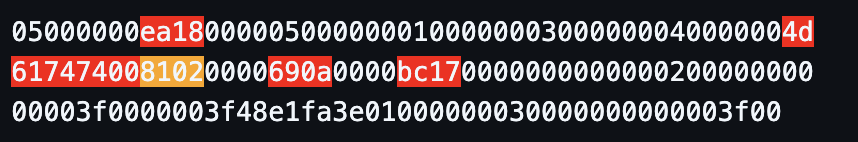

# SS Dat Info

Live link: https://domsleee.github.io/SS-Dat-Info/

Gets information from *.dat replay files of [Supreme Snowboarding](https://en.wikipedia.org/wiki/Supreme_Snowboarding).

Based on the awesome [DAT Analyzer by Oleg M](http://lohec.ho.ua/bonus.htm).

# Usage

```shell
cd typescript
bun install
bun src/index.ts <replayFile>
```

An example for Forest Medium 54.35 ([Replay](./replays/Forest/Medium/0.54.35%20Matt.dat), [Video](https://www.youtube.com/watch?v=hUP-RKbN9mU)), it's interesting because the start line is far away (3.4s after starting):

```shell
❯ bun ./src/index.ts analyze '../replays/Forest/Medium/0.54.35 Matt.dat'
{
  playerName: "Matt",
  trackName: "Forest MediumOrHard",
  displayedMs: 54350,
  startMs: 3400,
  totalMs: 57750,
  lagBeforeStartMs: 3010,
  lagAfterFinishMs: 3020,
  recordingMs: 63780,
  checkpoint1Ms: 20240,
}
```

Output of [DAT Analyzer by Oleg M](http://lohec.ho.ua/bonus.htm):
```shell
❯ ./Replay.exe "0.54.35 Matt.dat"
Data of race of Matt on 2016/8/23
Track: Forest Medium / Forest Hard / v2
 
Displayed time:                          54.35
Start time:                               3.40
Total time:                              57.75
 
Lag before start:                         3.01
Lag after finish:                         3.02
Recording time:                          63.78
 
Checkpoint 1 time:                       20.24
Checkpoint 2 time:                         n/a
 
Length of the route till finish, m:    2678.16
Average speed, km/h:                    166.95
Maximum speed, km/h:                    270.50
 
Distance breaks before/after finish:       0/0
Speed breaks before/after finish:          0/0
```

# Limitations

* Currently, only the 9 original tracks are supported
* A few tracks can't be told apart (yet)
  * Alpine EasyMediumOrHard
  * Forest MediumOrHard
* From what I can see, checkpoint 2 data is not in the replay file

# Todo

* The end coordinate should be able to tell Alpine Hard from Alpine Easy/Medium
* Maybe checkpoint 1 coordinate data can tell Alpine Easy / Medium apart?
   * Forest Medium/Hard can't really be told apart from what I can see
* Distribute as a standalone binary / exe file

# General description of the replay file & how it works

The replay file consists of a header and then data blocks of 109 bytes.

There are 100 data blocks for each second of gameplay.

The data is little endian. For example, for FM 54.35, the first 6 bytes are `05000000ea18`. `0xea18` in little endian is 6378, which is the total recording time in centiseconds (i.e. 63.78s).

The track name is currently determined by starting coordinate, which is why some tracks can't be told apart.

The timing info is mostly in the header, and the "start delay" is determined by the first time the player changes coordinate.

## Timing data explanation (FM 54.35)

Here is the header:
<!-- 
<p style="font-family: monospace">
05000000<span style="background-color: red">ea18</span>000005000000010000000300000004000000<span style="background-color: red">4d
61747400</span><span style="background-color: orange">8102</span>0000<span style="background-color: red">690a</span>0000<span style="background-color: red">bc17</span>0000000000000200000000
00003f0000003f48e1fa3e01000000030000000000003f00
</p> -->




* `ea00`: 6378 (63.78s): Total recording time
* `4d61747400`: `Matt`, terminated by `00`
* `8102`: 641  (6.41s) : cross start + start delay
* `690a`: 2665 (26.65s): Checkpoint 1 total time
* `bc17`: 6076 (60.76s): Total time to finish

The "Lag before start" is 3.01s, which based on coordinate data, not from the header.